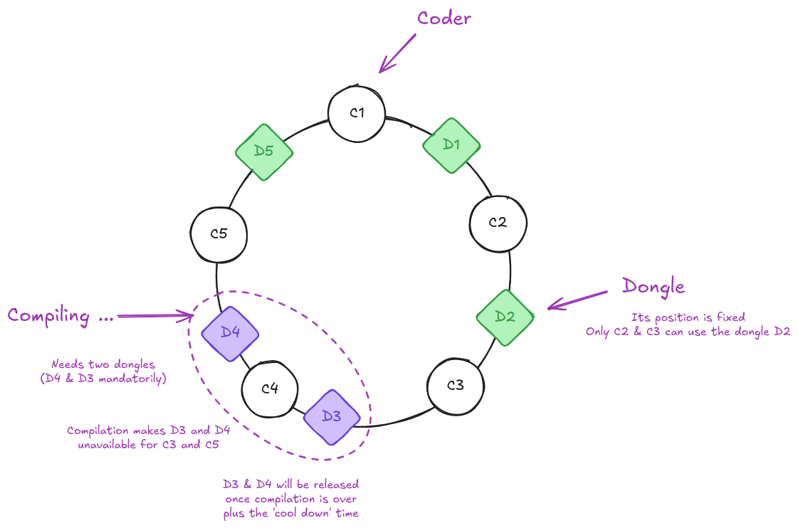
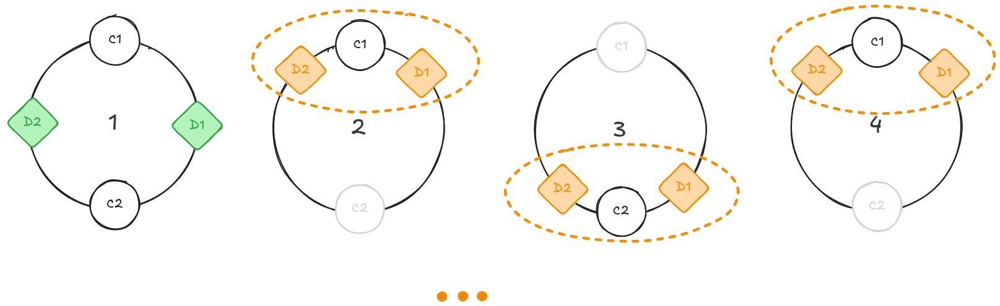
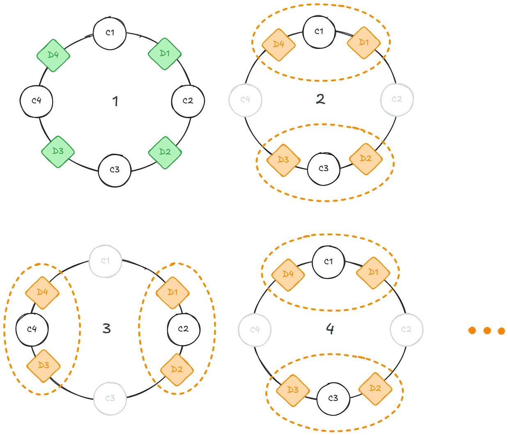
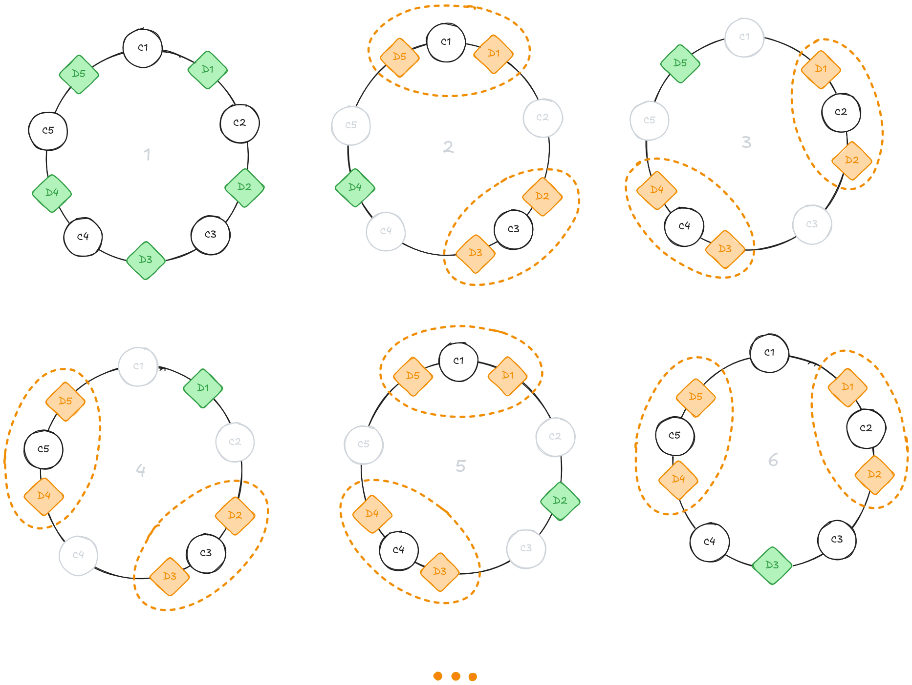

*This project has been created as part of the 42 curriculum by [flinguen](https://linguenheld.net/)*

## 42_codexion

Master the race for resources before the deadline masters you.

### Description

The purpose is to simulate several 'coders' who have to compile, debug and refactor their work.  
To do so, they sit on a circular table.  
To compile, they have to use two 'dongles'.  
Dongles are linked to two coders and can only perform one compilation at a time.  

Each coder is a thread which performs its steps when dongles are available.  
They have to complete n compilations and can't wait more than 'time_to_burnout' without any task.  

So the program has to prioritise the coders which their dongles.  


<div align="center">
    
</div>

### Usage

Clone the repository.
``` Bash
    git clone --recursive https://github.com/flinguenheld/42_push_swap
```

Then you can use the Makefile to compile.
``` Bash
    make fclean && make
```

To launch the program, you have to respect the argument formats:
- number_of_coders
- time_to_burnout
- time_to_compile
- time_to_debug
- time_to_refactor
- number_of_compiles_required
- dongle_cooldown
- scheduler (fifo / edf)

``` Bash
    ./codexion 5 600 50 50 50 20 5 fifo
```

To display the usage message:
``` Bash
    ./codexion
```
Example to check memory leaks:
<!-- valgrind --leak-check=yes ./codexion 3 600 50 50 50 20 5 fifo -->
``` Bash
valgrind --tool=helgrind ./codexion 3 600 50 50 50 20 5 fifo
```

##### 2 coders
<div align="center">
    
</div>

##### 4 coders
<div align="center">
    
</div>


##### 5 coders
<div align="center">
    
</div>
