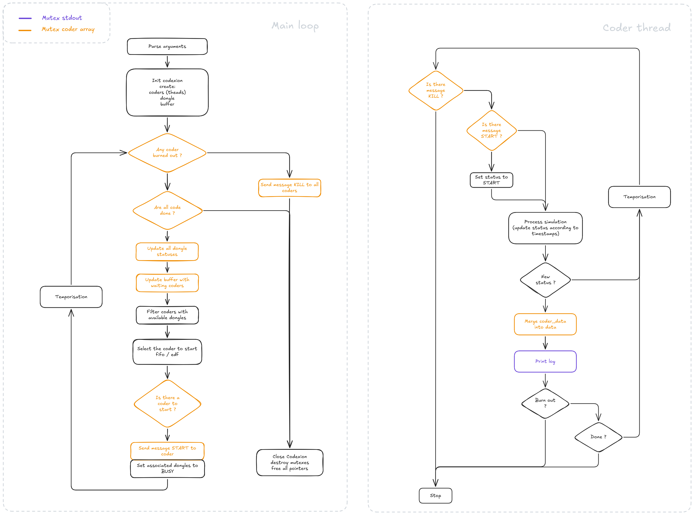
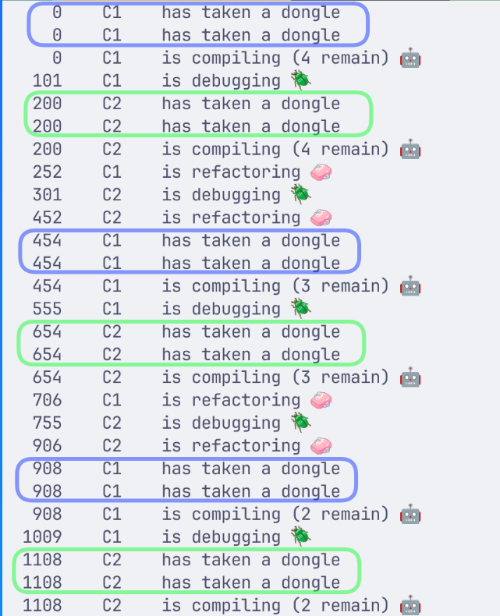
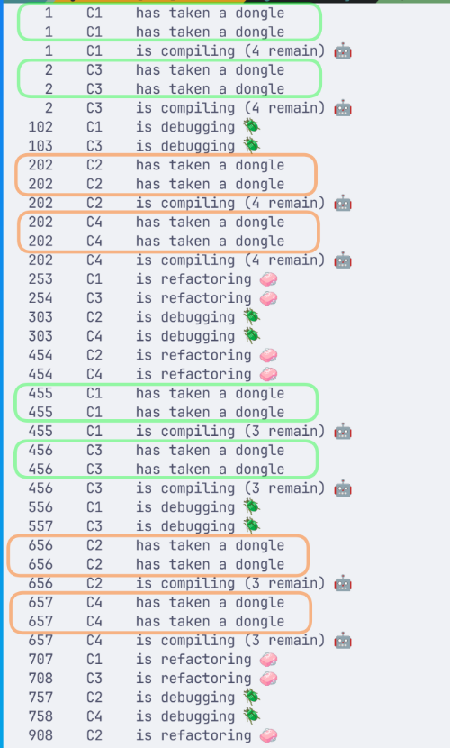
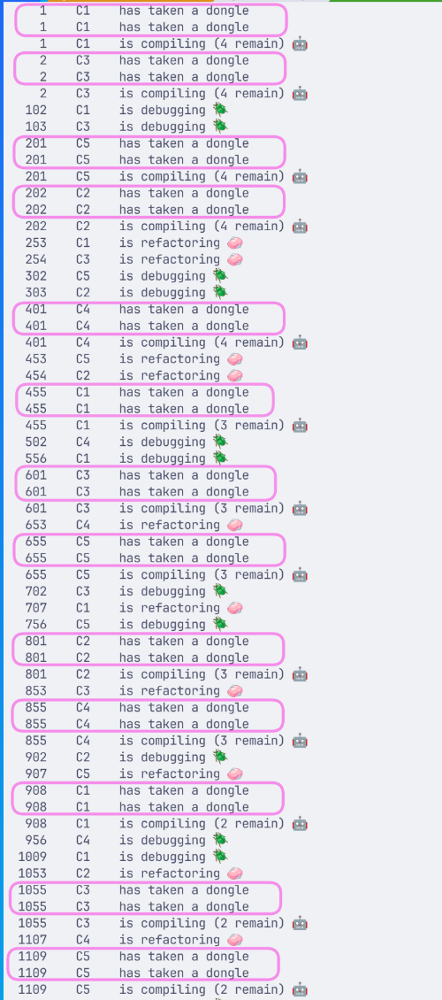

*This project has been created as part of the 42 curriculum by [flinguen](https://linguenheld.net/)*

## 42_codexion

Master the race for resources before the deadline masters you.

### Description

The purpose is to simulate several 'coders' who have to compile, debug and refactor their work.  
To do so, they sit on a circular table.  
To compile, they have to use two 'dongles'.  
Dongles are linked to two coders and can only perform one compilation at a time.  

Each coder is a thread which performs its steps when dongles are available.  
They have to complete n compilations and can't wait more than 'time_to_burnout' without any task.  

So the program has to prioritise coders with their dongles.  


<div align="center">
    
</div>

### Instructions

Clone the repository.
``` Bash
    git clone --recursive https://github.com/flinguenheld/42_push_swap
```

Then you can use the Makefile to compile.
``` Bash
    make fclean && make
```

To launch the program, you have to respect the argument formats:
- number_of_coders
- time_to_burnout
- time_to_compile
- time_to_debug
- time_to_refactor
- number_of_compiles_required
- dongle_cooldown
- scheduler (fifo / edf)

``` Bash
    ./codexion 5 600 50 50 50 20 5 fifo
```

To display the usage message:
``` Bash
    ./codexion
```
Example to check memory leaks, data races or deadlocks:
``` Bash
valgrind --leak-check=yes ./codexion 3 600 50 50 50 20 5 fifo
```
``` Bash
valgrind --tool=helgrind --track-lockorders=yes ./codexion 3 600 50 50 50 5 5 fifo
```
``` Bash
valgrind --tool=drd --show-stack-usage=yes ./codexion 3 600 50 50 50 5 5 fifo
```

### Blocking cases handled

To complete my solution, I tried to be as simple as possible.  
So the program creates a [struct data](https://github.com/flinguenheld/42_codexion/blob/master/data/data.h#L18), which is read-only and created thanks to user's arguments.  
Then, a [struc codexion](https://github.com/flinguenheld/42_codexion/blob/master/codex/codexion.h#L29) which contains:
- an array of coders
- a buffer (which is another array of coders)
- an array of dongles (dongles are represented by their [status](https://github.com/flinguenheld/42_codexion/blob/master/dongle/dongle.h#L19) either BUSY or AVAILABLE)
- a mutex used for coders
- a mutex used for stdout

Coders are made of two structs:
- [t_coder](https://github.com/flinguenheld/42_codexion/blob/master/coder/coder.h#L51) used to store:
    - read-only data (like the thread id or mutexes)
    - messages (to send an order to the coder)
    - coder_data
- [t_coder_data](https://github.com/flinguenheld/42_codexion/blob/master/coder/coder.h#L43) used in the thread to simulate its works
    - status
    - amount of remain jobs
    - timestamps

This division allows threads to only update their coder_data when there are any update (new status for instance).  
It can merge the new coder_data in coder and avoid using the mutex on each data read.  

The [core loop](https://github.com/flinguenheld/42_codexion/blob/master/codex/codexion.c#L60) is in charge of checking the coders' statuses.  
So it will [list](https://github.com/flinguenheld/42_codexion/blob/master/codex/codexion_utils.c#L15) those which are waiting in the buffer and filter those with available.  
Once done, it will select the best according to the fifo or edf logic:
- fifo: the first coder which has reclaimed a dongle
- edf: the coder which is the closer to the burnout

And because all coders have the same timers, the first coder which has reclaimed a dongle is mandatorily the coder which is the closiest to the burnout.  
So yes, they do the same thing -_-'.  

After having selected the coder, the message in the t_coder struct is set to START.
- The [main coder loop](https://github.com/flinguenheld/42_codexion/blob/master/coder/coder.c#L62) will catch the message and start its process.
- And the associated dongles are set to BUSY.

### Thread synchronization mechanisms

The synchronisation is perfomed thanks to two mutexes to prevent data races on stdout and the coder array.  
The [core loop](https://github.com/flinguenheld/42_codexion/blob/master/codex/codexion_utils.c#L15) checks regularily the coders status to catch any burn out.  
And it can [send](https://github.com/flinguenheld/42_codexion/blob/master/codex/codexion.c#L50) an order to the coder to launch or kill them.  
The [message is read](https://github.com/flinguenheld/42_codexion/blob/master/coder/coder.c#L21) in the main coder loop.  

Then the [close_codexion](https://github.com/flinguenheld/42_codexion/blob/master/codex/codexion.c#L115) function joins all threads and clear all malloc data.  

<div align="center">
    
</div>

### Logic representation

Since all coders take the same time for all their processes,  
we can predict the evolution which should be the same for fifo or edf:  

##### 2 coders
``` Bash
    ./codexion 2 300 100 150 200 5 100 fifo
```
<div align="center">
    
    
</div>

##### 4 coders
``` Bash
    ./codexion 4 300 100 150 200 5 100 fifo
```
<div align="center">
    
    
</div>


##### 5 coders
With an odd amount of coders, the more complicated:  
``` Bash
    ./codexion 5 400 100 150 200 5 100 fifo
```
<div align="center">
    
    
</div>

### Resources

[https://www.geeksforgeeks.org/c/multithreading-in-c/](https://www.geeksforgeeks.org/c/multithreading-in-c/)  
[https://www.geeksforgeeks.org/operating-systems/mutual-exclusion-in-synchronization/](https://www.geeksforgeeks.org/operating-systems/mutual-exclusion-in-synchronization/)  
[https://excalidraw.com/](https://excalidraw.com/)  
